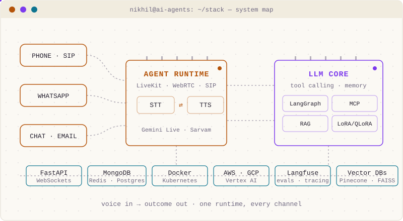
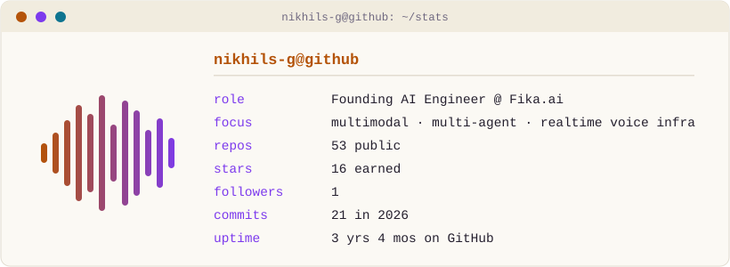

I build **AI agents that automate real business and get measured on outcomes** — voice agents that talk on the phone (LiveKit + SIP, streaming STT-LLM-TTS), WhatsApp commerce agents that take a customer from catalog to Razorpay payment without leaving the chat, and the chat & email automation around them. Founding AI Engineer at [Fika.ai](https://powersmy.biz). The metric is never the demo — it's collection rates, bookings, and latency. Hyderabad, India.

### Open source

[**livekit/agents #4798**](https://github.com/livekit/agents/pull/4798) · `fix(sarvam): prevent transcript loss after long agent responses`

A race condition in the Sarvam STT plugin: agent responses longer than ~10 s triggered premature task cancellation while buffered audio was still being processed — transcripts were silently dropped and the agent went mute mid-call. Found it running live voice-agent operations; fixed it upstream.

### Now

| | |
|---|---|
| **Building** | Multi-channel AI agents (voice · WhatsApp · chat · email) for healthcare, fintech and real-estate clients at Fika.ai |
| **Running** | Live voice-agent ops — SIP trunks, STT/TTS provider A/B tests, per-call cost & latency telemetry |
| **Exploring** | Speech-to-speech (Gemini Live), predictive & outbound dialers, MCP tool servers |

### Selected work

| | Project | The number that matters |
|---|---|---|
| Voice | **WhatsApp Voice Bridge** | WhatsApp Desktop → WASAPI → LiveKit → Gemini Live: two-way audio at **300–800 ms RTT**, zero SIP cost |
| Voice | **LiveKit SIP Manager** | Full-stack SIP ops dashboard — trunks, dispatch rules, IP whitelisting, dialer — **zero CLI** |
| Agents | **NBFC collections voice agent** | Production collections calls at Fika.ai — **collection rate up 50%** |
| Agents | **LangGraph + RAG assistant** | **Sub-5 s** end-to-end latency, 15% engagement uplift |
| Lab | [**ai-experiments-lab**](https://github.com/Nikhils-G/ai-experiments-lab) | Reproducible experiments across ML · DL · NLP · LLMs, one concept at a time |

More on [nikhilsukthe.vercel.app](https://nikhilsukthe.vercel.app/).

### One runtime, every channel

### Live stats

### Recent activity

<!-- ACTIVITY:START -->
- Pushed 2 commits to [Nikhils-G/Nikhils-G](https://github.com/Nikhils-G/Nikhils-G) · Aug 17
<!-- ACTIVITY:END -->

---

[Website](https://nikhilsukthe.vercel.app/) · [LinkedIn](https://www.linkedin.com/in/nikhilsukthe) · [Email](mailto:sukthenikhil@gmail.com) · [ORCID](https://orcid.org/0009-0009-8318-1049)

This profile updates itself — a daily [GitHub Action](.github/workflows/profile.yml) runs [one Python script](scripts/update_profile.py) that regenerates the stats card and activity feed. <!-- UPDATED:START -->
Last refreshed: 2026-08-21 (UTC).
<!-- UPDATED:END -->

