I work the whole AI stack, not one layer of it — **data science, machine learning, deep learning, GenAI agents, voice AI, MLOps** — and I get measured on outcomes. I've engineered datasets and tokenizers from raw dialog, built a transformer from scratch in PyTorch, fine-tuned Qwen2.5-7B with QLoRA and served it on vLLM, and shipped the agents on top: voice agents on LiveKit + SIP, WhatsApp commerce agents that take a customer from catalog to Razorpay payment, chat and email automation. Founding AI Engineer at [Fika.ai](https://powersmy.biz). The metric is never the demo — it's collection rates, F1 against the baseline, latency, cost per call. Hyderabad, India.

### Pick up the phone

That timer is real time. There is no server behind it — the whole call is one hand-written SVG.

### Every role, one person

| Role | Evidence |
|---|---|
| **Data Scientist** | Engineered a 200K-pair DailyDialog dataset (truncation negatives, ASR normalization) and a custom BPE tokenizer; large-scale EDA and feature work; beat the cue-word baseline — **F1 0.798 vs 0.753, AP 0.832 vs 0.624** |
| **ML Engineer** | Fine-tuned **Qwen2.5-7B via QLoRA** (PyTorch/TRL) → **89% accuracy**, served on **vLLM**; ensembles, cross-validation, hyperparameter search, regularization, early stopping |
| **Deep Learning Engineer** | **TurnWave** — 7M-param causal transformer (RoPE · RMSNorm · SwiGLU) built **from scratch in PyTorch**, no pretrained weights; CNNs · RNNs/LSTMs · GANs · diffusion models; TensorFlow/Keras, Hugging Face Transformers |
| **GenAI / Agents Engineer** | Multi-agent systems, RAG (semantic routing · hybrid search), MCP, tool calling, LangGraph/LangChain, prompt engineering & guardrails, multi-key LLM gateway (routing · load balancing · failover) across Gemini, OpenAI, Claude |
| **Voice AI Engineer** | LiveKit SIP/WebRTC, real-time STT-LLM-TTS, speech-to-speech (Gemini Live), Silero VAD, turn detection, SIP trunking, predictive/outbound dialers; WhatsApp → LiveKit bridge at **300–800 ms RTT** |
| **MLOps / Evals** | Docker, Kubernetes, CI/CD, AWS, GCP Vertex AI; Langfuse, Grafana, Prometheus, Loki; LLM-as-judge evals, cost/latency telemetry, provider A/B tests |
| **Backend & Data Engineer** | FastAPI, REST & WebSockets, async Python; MongoDB (Atlas Vector Search), Redis, PostgreSQL; vector databases — Pinecone, FAISS, ChromaDB; Python · SQL · JavaScript/TypeScript |

### Open source

[**livekit/agents #4798**](https://github.com/livekit/agents/pull/4798) · `fix(sarvam): prevent transcript loss after long agent responses`

A race condition in the Sarvam STT plugin: agent responses longer than ~10 s triggered premature task cancellation while buffered audio was still being processed — transcripts were silently dropped and the agent went mute mid-call. Found it running live voice-agent operations; fixed it upstream.

[**charmbracelet/crush #3644**](https://github.com/charmbracelet/crush/pull/3644) · `fix(ui): show provider for models with duplicate names` — in Go. Running the Ox Alpha model on this agentic tool threw "Unauthorized" with a valid key: two providers exposed the same model name and the request was misrouted at the provider level.

### Now

| | |
|---|---|
| **Building** | Multi-channel AI agents (voice · WhatsApp · chat · email) for healthcare, fintech and real-estate clients at Fika.ai |
| **Running** | Live voice-agent ops — SIP trunks, STT/TTS provider A/B tests, per-call cost & latency telemetry |
| **Exploring** | Speech-to-speech (Gemini Live), predictive & outbound dialers, MCP tool servers |

### Selected work

| | Project | In one line |
|---|---|---|
| Deep learning | **TurnWave** | End-of-turn detection for voice agents — a 7M-param transformer from scratch in PyTorch that replaces fixed silence timeouts; **F1 0.798 vs 0.753** cue-word baseline |
| ML | **Qwen2.5-7B QLoRA fine-tune** | PyTorch/TRL, 4-bit — **89% accuracy** at production volume, served via vLLM |
| Voice | **WhatsApp Voice Bridge** | WhatsApp Desktop → WASAPI → LiveKit → Gemini Live: two-way audio at **300–800 ms RTT**, zero SIP cost |
| Voice | **LiveKit SIP Manager** | Full-stack SIP ops dashboard — trunks, dispatch rules, IP whitelisting, dialer — **zero CLI** |
| Agents | **NBFC collections voice agent** | Production collections calls at Fika.ai — **collection rate up 50%** |
| Agents | **LangGraph + RAG assistant** | **Sub-5 s** end-to-end latency, 15% engagement uplift |
| Deep learning | [**Tooth detection & FDI numbering**](https://github.com/Nikhils-G/Automated-Tooth-Detection-and-FDI-Numbering-Using-Deep-Learning) | CNN pipeline that finds every tooth on a dental X-ray and assigns its FDI number automatically |
| ML | [**Fraud detection on banking data**](https://github.com/Nikhils-G/Fraud-Detection-with-SVMSMOTE-Neural-Networks) | SVMSMOTE resampling + neural networks on heavily imbalanced transaction data |
| Lab | [**ai-experiments-lab**](https://github.com/Nikhils-G/ai-experiments-lab) | Reproducible experiments across ML · DL · NLP · LLMs, one concept at a time |

More on [nikhilsukthe.vercel.app](https://nikhilsukthe.vercel.app/).

### Background

| | | |
|---|---|---|
| 2025 – now | **Fika.ai** (powersmy.biz) — Founding AI Engineer | Production voice + WhatsApp + multi-channel agents; QLoRA fine-tuning; live voice-agent ops |
| 2024 – 2025 | **Caprae Capital Partners** — ML Engineer Intern | Designed an LLM deal-research agent (LangChain, LangGraph); optimized LLM inference and scalability |
| 2023 – 2024 | **IIT Hyderabad** — Researcher, AI & Data Science | Studied the 2017 Transformer paper and implemented attention; built and improved ML models |
| 2025 | **CMR College of Engineering & Technology** | B.Tech in Artificial Intelligence & Data Science · minor in Cyber Security · CGPA 8.27 |

Splunk Build-A-Thon winner · IBM Z DataThon 2024 appreciation

### Meanwhile, in the lab

### One runtime, every channel

---

[Website](https://nikhilsukthe.vercel.app/) · [LinkedIn](https://www.linkedin.com/in/nikhilsukthe) · [Email](mailto:sukthenikhil@gmail.com) · [ORCID](https://orcid.org/0009-0009-8318-1049)

