AI engineer across the whole stack — data → models → agents → outcomes. Founding AI Engineer at [Fika.ai](https://powersmy.biz). Hyderabad, India.

| Proof | |
|---|---|
| **TurnWave** | 7M-param transformer built from scratch in PyTorch for end-of-turn detection — F1 0.798 vs 0.753 cue-word baseline |
| **Qwen2.5-7B QLoRA** | 89% accuracy at production volume, served on vLLM |
| **Collections voice agents** | Live at Fika.ai — collection rate up 50% |
| **WhatsApp → LiveKit bridge** | Two-way voice on Gemini Live at 300–800 ms RTT, zero SIP cost |

Upstream: [livekit/agents #4798](https://github.com/livekit/agents/pull/4798) · [charmbracelet/crush #3644](https://github.com/charmbracelet/crush/pull/3644)

B.Tech in AI & Data Science, CMR · previously Caprae Capital (ML) and IIT Hyderabad (research)

[Website](https://nikhilsukthe.vercel.app/) · [LinkedIn](https://www.linkedin.com/in/nikhilsukthe) · [Email](mailto:sukthenikhil@gmail.com) · [ORCID](https://orcid.org/0009-0009-8318-1049)
